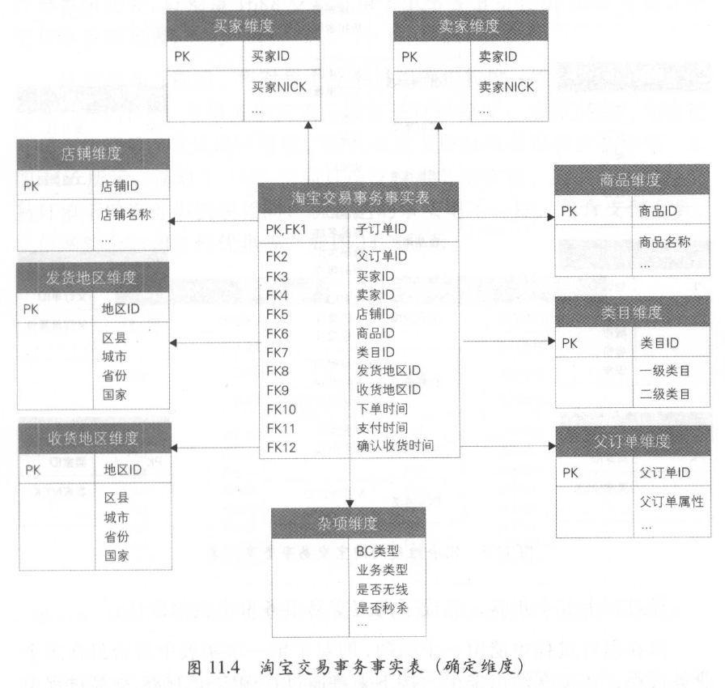
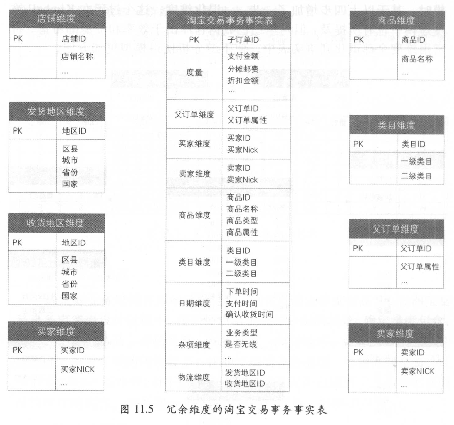

<head>
<link href = '../../css/notestyle.css' rel = 'stylesheet' type = 'text/css'>
</head>

# 阿里巴巴大数据之路第11章：事实表设计

## 事实表基础
### 事实表特性
* 通过获取描述业务过程的度量来表达业务过程。
* 事务事实表、周期快照事实表、累积快照事实表
### 事实表设计原则
* 1、尽可能包含所有与业务过程相关的事实
* 2、只选择与业务过程相关的事实（订单下单业务不应出现支付金额）
* 3、分解不可加性事实为可加的组件
* 4、在选择维度和事实之前先声明粒度
* 5、同一事实表内不能有多种粒度
* 6、事实的单位要保持一致
* 7、对事实的null度量值要做处理
* 8、使用退化维度提高事实表的易用性
### 事实表设计方法
* 1、选择业务过程，确定事实表类型
* 2、声明粒度
* 3、确定维度
* 4、确定事实
* 5、冗余维度
## 事务事实表
### 设计过程
* 1、选择业务过程，抽象业务过程
* 2、确定粒度，根据最小粒度原则确定粒度
* 3、确定维度，可以参考统计分析场景确定维度
* 4、确定事实
* 
* 5、退化冗余维度便于使用
* 
### 单事务事实表
