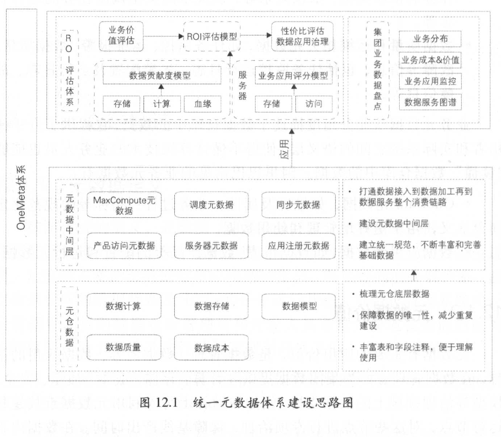

<head>
<link href = '../../css/notestyle.css' rel = 'stylesheet' type = 'text/css'>
</head>

# 阿里巴巴大数据之路第12章：元数据
## 元数据概述
### 元数据定义
* 元数据是关于数据的数据。
* 分为技术元数据（Tech Metadata）和业务元数据（Business Metadata）
#### 技术元数据
* 分布式计算系统存储元数据：记录表的表名；分区信息、责任人信息、文件大小、表类型、生命周期；列字段名、字段类型、字段备注等信息。
* 分布式计算系统运行元数据：MaxCompute上所有作业运行等信息，包括作业类型、实例名称、输入输出、sql、运行参数、执行时间等
* 数据开发平台中数据同步、计算任务、任务调度等信息
* 数据质量和运维相关元数据
#### 业务元数据
* 维度及属性、业务过程、指标等规范化定义，用于更好地管理和使用数据。
* 数据应用元数据，如数据报表、数据产品等的配置和运行元数据。
### 元数据价值
* 是数据管理、内容、应用的基础，在数据内容方面为数据进行数据域、数据主题、业务属性等方面的提取和分析，提供数据素材。
### 统一元数据体系建设
* 
## 元数据应用
* 数据价值在于数据驱动决策。
* 元数据可以指导数据相关人员进行日常工作，实现数据化“运营”。
### Data Profile
* 核心思路是为纷繁复杂的数据建立一个脉络清晰的数据图谱。针对元数据设计了四类标签：基础标签、数仓标签、业务标签、潜在标签。
### 元数据门户
* 略
### 应用链路分析
* 对于某个数据计算任务或表，其重要程度如何，是否还有下游在使用，是否可以下线，都依赖着哪些表，这些表是否需要根据应用重要程度进行资源、运维保障，元数据血缘可以分析产品及应用的链路，通过血缘链路可以清楚地统计到某个产品所用到的数据在计算、存储、质量上存在哪些问题，通过治理优化保障产品数据的稳定性。
### 数据建模
* 基于现有底层数据已经有下游使用的情况，我们可以通过下游所使用的元数据指导数据参考建模。
* 表的基础元数据，包括下游情况、查询次数、关联次数、聚合次数、产出时间等。
* 表的关联关系元数据，包括关联表、关联类型、关联字段、关联次数等。
* 表的字段的基础元数据，包括字段名称、字段注释、查询次数、关联次数、聚合次数、过滤次数等。
* 基于下游使用关联或查询次数大于某个阈值的表，筛选用于数据建模的表。
* 基于表的字段元数据，选择业务过程标识字段。
* 基于主从表的关联关系、关联次数，确定和主表关联的从表。
* 基于主从表的字段使用情况，确定哪些字段进入目标模型。
### 驱动ETL开发
* 略

