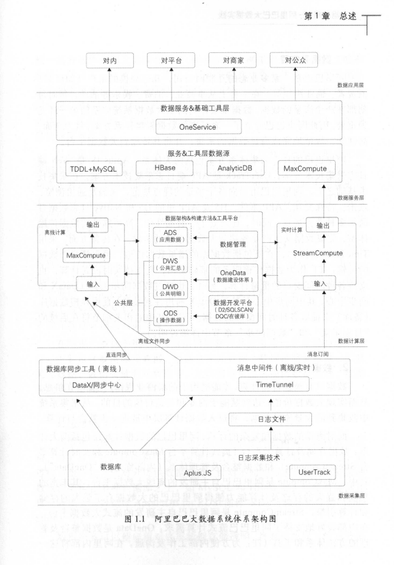

<head>
<link rel = 'stylesheet' type = 'text/css' href = '../../css/notestyle.css'>
</head>

# 阿里巴巴大数据之路第1章：概览

## 通用
* 数据架构图
* 

## 数据采集层
* web端日志采集技术方案 Aplus.JS 
* app端日志采集技术方案 UserTrack 
* 消息中间件（离线/实时） TimeTunnel
* 数据库同步工具（离线） DataX/同步中心

## 数据计算层
* 离线计算平台 MaxCompute
* 实时计算平台 StreamCompute
* 数据整合及管理体系 OneData
### 数据加工链路
* 操作数据层
* 明细数据层
* 汇总数据层
* 应用数据层
### 元数据模型整合及应用
* 数据源、数据仓库、数据链路、工具类、数据质量等元数据

## 数据服务层
* 数据源架构在数据库之上，MySQL和HBase等
* 统一的数据服务平台OneService：简单数据查询、复杂数据查询、实时数据推送。

## 数据应用层
* 搜索、推荐、广告、金融、信用、保险、文娱、物流等。
* 对内阿里数据平台，对外数据产品——生意参谋

