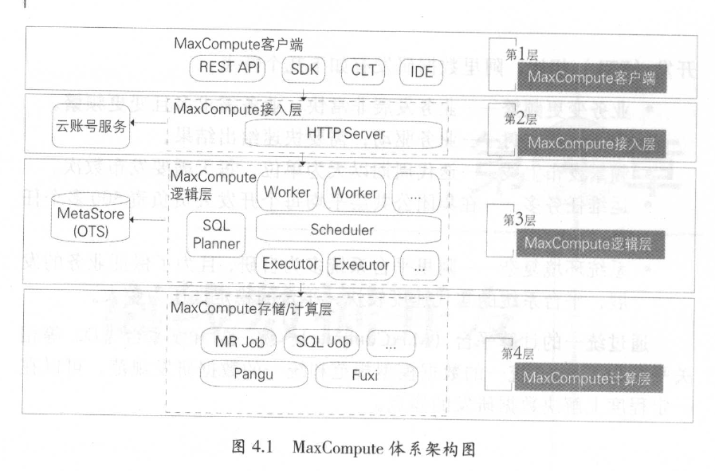

<head>
<link href = '../../css/notestyle.css' rel = 'stylesheet' type = 'text/css'>
</head>

# 阿里巴巴大数据之路第4章：离线数据开发
## 数据开发平台
* 了解需求→模型设计→ETL开发→测试→上线→运维→下线
### 统一计算平台MaxCompute
* 包含数据上传下载通道、SQL、MapReduce、机器学习算法、图编程模式、流式计算模型以及完善的安全解决方案。
#### 体系架构
* 
* 客户端、接入层、逻辑层、存储与计算层
* 客户端提供web api、封装好的SDK、CLT工具、IDE可视化ETL/BI工具
* 接入层提供HTTP服务、缓存Cache、负载均衡，用户认证以及访问控制
* 逻辑层（控制层）：  
  worker处理操作请求，生成各种instance(job、task)请求;  
  scheduler调度拆解job;  
  executor负责instance(job)执行，向计算层提交真正的计算任务;
* 计算层独立集群。
#### 优势
* 计算能力强大
* 集群规模大、稳定性高
* 功能组件强大
* 安全性高
### 统一开发平台
* 集成开发、调试、发布等功能的一站式数据开发平台
* 优化用户SQL的sqlscan
* 检查数据质量的Data quelity Center数据质量中心，强弱规则做数据监控以及数据清洗。
* 数据监控常见规则有：主键监控、数据量以及波动监控、重要字段非空监控、重要枚举字段离散值监控、指标值波动监控等
* 数据清洗分为侵入式 or 非侵入式，在ODS层做清洗以及归档记录
* 数据测试：功能测试，验证目标数据是否符合预期
## 任务调度系统
### 背景
* 对繁杂的任务类型以及大量任务做调度，保证任务执行的优先级区分、并发、串行、管理维护
### 介绍
#### 数据开发流程与调度系统的关系
* 开发平台提交的任务节点，需要经过调度系统，按照任务运行顺序调度运行。
#### 调度系统的核心设计模型
* 调度引擎 和 执行引擎（Alisa）
* 调度引擎根据任务节点属性以及依赖关系进行实例化，生成各类参数实值，生成调度树。
* 执行引擎根据任务实例以及配置信息，分配CPU、内存、运行节点等资源，在对应环境中执行节点代码。
### 特点及应用
* 调度配置：自动识别输入输出表，实现自动调整任务依赖。
* 定时调度：细化时间粒度
* 周期调度：类似事件调度，无需指定具体时间
* 手动脚本
* 便利的补数据任务
* 优化基线管理：任务按照优先级划分
* 监控报警

