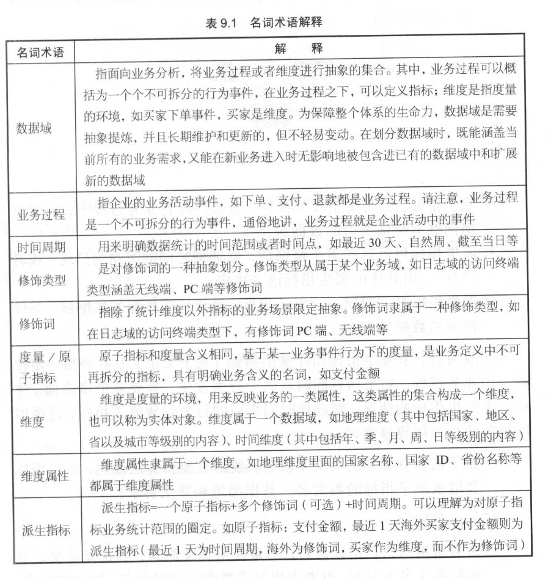
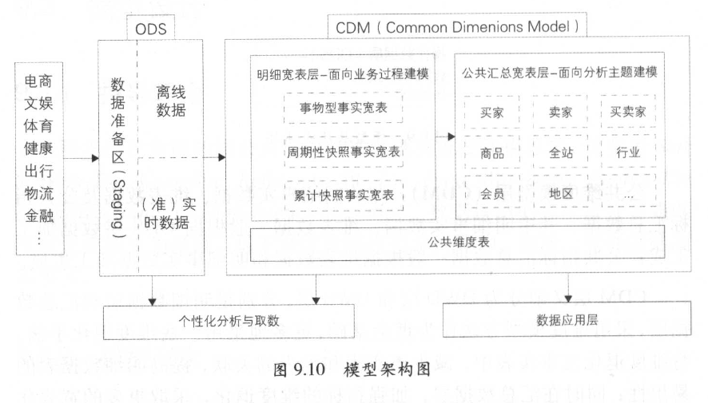
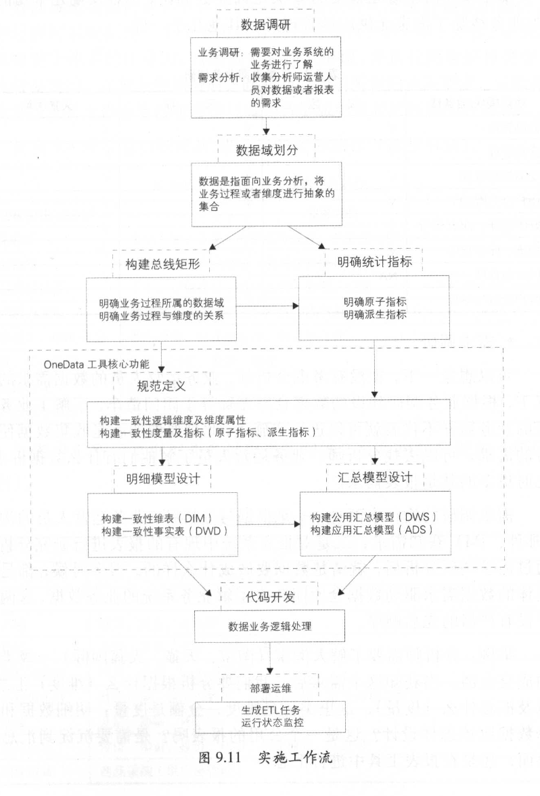

<head>
<link href = '../../css/notestyle.css' rel = 'stylesheet' type = 'text/css'>
</head>

# 阿里巴巴大数据之路第9章：阿里巴巴数据整合及管理体系
* 避免数据的冗余和重复建设，规避数据烟囱和不一致性，构建统一、规范、可共享的全域数据体系。
## 概述
* 从业务架构设计到模型设计，从数据研发到数据服务，做到数据可管理、可追溯、可规避重复建设。
### 定位及价值 
* 标准化、规范化系统建设，降低数据互通等各种人力资源提诶
### 体系架构
* 业务板块：根据业务属性划分出几个相对独立的业务板块，指标or业务重叠性较小。
* 规范定义：一套数据规范命名体系
* 模型设计：以维度建模理论为基础，基于维度建模总线架构，构建一致性的维度和事实。设计一套表规范命名体系
## 规范定义
* 规范定义指以维度建模作为理论基础，构建总线矩阵，划分和定义数据域、业务过程、维度、度量/原子指标、修饰类型、修饰词、时间周期、派生指标。
### 名词术语 
* 
* 数据域/业务域：业务过程的集合
* 业务过程：业务活动事件，如下单、支付
* 时间周期：明确数据统计时间范围or节点
* 修饰类型：修饰词的划分
* 修饰词：例如访问端存在PC端、无线端等
* 度量/原子指标：业务定义中的最小指标，具有明确业务含义的名词，如支付金额，原子指标=动作+度量
* 维度：实体对象，根据某类属性将业务进行集合
* 维度属性：实体对象的属性，如地理维度下国家名称、国家ID
* 派生指标：原子指标+修饰词（可选）+时间周期，如，最近1天海外买家支付金额（时间周期+修饰词+维度+原子指标）
### 指标体系
#### 操作细则
* 派生指标：事务型指标、存量型指标和复合型指标
* 事务型指标：对业务活动的衡量，新增会员数
* 存量型指标：对实体对象状态的统计，已注册会员数
* 复合型指标：上述两种指标基础上复合而成，如比例、比率、变化、排名等类型指标
#### 其他规则
* 上下层级派生指标同时存在时，建议把细化下层级放在上层级的维度属性内。
* 父子关系原子指标存在时，建议使用子原子指标
## 模型设计
### 指导理论
* 遵循维度建模思想
### 模型层次
* 表数据模型三层：操作数据层ODS、公共维度模型层CDM、应用数据层ADS
* 
#### ODS层
* 数据几乎无处理，仅做同步和结构化处理，作为原数据层应对审计等工作
#### CDM层
* 存放事实数据、维表数据、公共指标汇总数据，更多地采用维度退化手法，采用宽表化手段构建公共指标数据层，提升复用性。
* CDM = DWD + DWS
* 建立一致性维度：建立一致的维表，降低口径不统一风险
#### ADS层
* 个性化指标加工：不公用性、复杂性
* 基于应用数据组装：大宽表集市、趋势指标表
### 基本原则
* 高内聚和低耦合：将业务相近或相关、粒度相同的数据设计为一个逻辑/物理模型，高概率同时访问的数据放在一起，低概率同时访问数据分开存储。
* 核心模型与扩展模型分离：让支撑个性化需要的扩展模型较少地介入核心模型，以免破坏核心模型的架构简洁性与可维护性。
* 公共处理逻辑下沉及单一：不要让公用处理逻辑暴露给应用层实现，不要让公共逻辑在多处同时存在。
* 成本与性能平衡：可以接受适当的数据冗余
* 数据可回滚：处理逻辑不变，在不同时间多次运行数据结果保证不变
* 一致性：具有相同含义的字段在不同表的命名必须相同，必须使用规范定义中的名称。
* 命名清晰、可理解：利于理解
## 模型实施
* 
### 数据调研
* 业务调研+需求调研
* 需求调研：与业务或分析师直接沟通、从现有报表出发
### 架构设计
* 数据域划分
* 构建总线矩阵：明确每个业务域下有哪些业务过程，哪些业务过程与哪些维度相关，并定义每个数据域下的业务过程和维度
### 规范定义
* 主要定义指标体系：原子指标、修饰词、时间周期和派生指标
### 模型设计
* 规范定义、维表和明细事实表和汇总事实表的模型设计
### 总结
* 高度迭代和动态过程，采用螺旋式实施方式，引入评审机制，确保模型实施过程的正确性。

